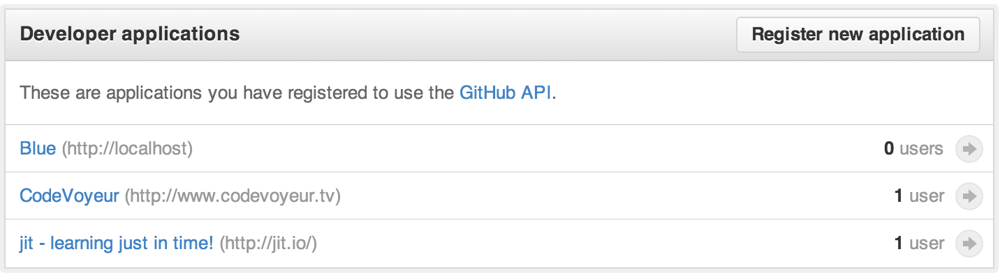
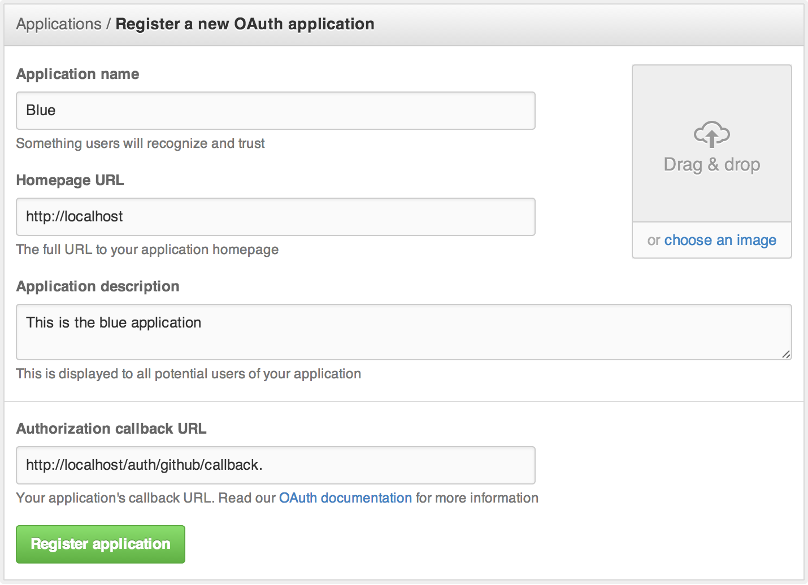
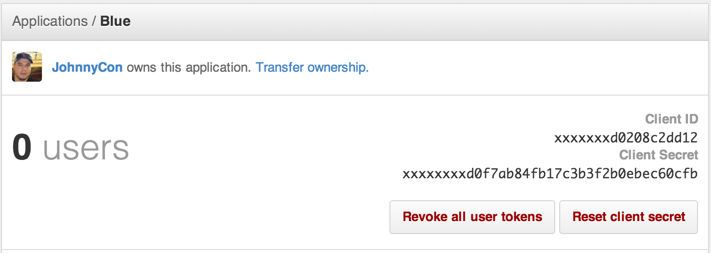

Week 7 (Wednesday)
===================

## Overview

This week we'll focus on adding a 3rd party login provider to our application.
Providing a username/password option, is a nice practive for users who don't
have social media accounts, but providing access via social media channels is a
nice incentive and can improve sign-up rates. 


## What is OAuth

Auth is an open standard for authorization. OAuth provides client applications a 'secure delegated access' to server resources on behalf of a resource owner. It specifies a process for resource owners to authorize third-party access to their server resources without sharing their credentials.

What this means in practice:
I provides a simple and standard way for applications to share protected data,
while still be able to revoke that data at any time. 

In the early days (in still practiced today), some websites would collect and
store your username/password in clear text in order to access your data.  This
is a dangerous practice and should be avoided. OAuth was created as a way to
solve for these scnearios

## OAuth 1.0 vs. 2.0

OAuth 1.0 was the original OAuth implementation and is still in use today, most
notably by Twitter.  OAuth 1.0 was difficult for users to implement on their own
due to the number of secrets, keys and tokens needed, and the interaction and
computations to make it all work. 

OAuth 2.0 was created to reduce this complexity, but also increased it's scope
to cover enterprise scenarios.  In this regard, OAuth 2.0 became both easier and
more difficult to user and understand.  

## OmniAuth

OmniAuth is a gem created by Intridea as a way to provide a consistent and easy
solution for developers to get started with OAuth. Omniauth hides 90% of the
complexity needed for doing OAuth integration.  There is a separate gem strategy
for each integration endpoint (i.e. twitter, github, facebook). 

## Adding Github sign-in to Blue
We will use Github Oauth integration to Blue. The reason we are choosing Github
is because all students in class have a Github account.  The other reason is
that Github uses OAuth 2.0 and has a very good API to further explore API Access
with OAuth.

## Implementing Github OAuth

**Register a new application with Github**



**Use the following values for your app**


**Add the Github Omniauth gem**
```ruby
gem 'omniauth-github'
```

**Add an omniauth initializer file**

You can grab your application client ID and secret from your application page.



**Add an initializer file for omniauth**

```ruby
# config/initializers/omniauth.rb
Rails.application.config.middleware.use OmniAuth::Builder do
  provider :github, ENV['GITHUB_KEY'], ENV['GITHUB_SECRET'], scope: 'user.email'
end
```

**Add a few new attributes to our user model**

We will to add uid, name, and provider to our user model

```ruby
rails g migration add_attributes_to_user uid:string name:string provider:string
```

**enhance our user model to the following**
```ruby
class User < ActiveRecord::Base
  # Include default devise modules. Others available are:
  # :confirmable, :lockable, :timeoutable and
  devise :database_authenticatable, :registerable,
         :recoverable, :rememberable, :trackable, :validatable,
         :omniauthable

  def self.create_with_omniauth(auth)
    create! do |user|
      user.provider = auth['provider']
      user.uid = auth['uid']
      user.name = auth['info']['name']
    end
  end

end
```

**add our new sessions controller**

```ruby
class SessionsController < ApplicationController

  def create
    auth = request.env['omniauth.auth']
    user = User.find_by_provider_and_uid(auth['provider'], auth['uid']) || User.create_with_omniauth(auth)
    session[:user_id] = user.id
    redirect_to root_url, notice:  'Signed in!'
  end

  def destroy
    session[:user_id] = nil
    redirect_to root_url, notice: 'Signed out!'
  end

end
```


